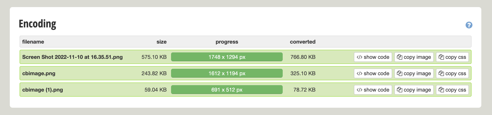

# Usecase
## Resize Image:
- Demo resize image base64:
```go
package usecase

import (
	"bufio"
	"bytes"
	"encoding/base64"
	"fmt"
	"image"

	"github.com/disintegration/imaging"
)

func ResizeImageFromBase64(imgBase64 string, newHeight int) (string, error) {
	// convert image is base64 to byte
	unbased, err := base64.StdEncoding.DecodeString(imgBase64)
	if err != nil {
		return "", fmt.Errorf("cannot decode base64 err=%v", err)
	}

	r := bytes.NewReader(unbased)
	// use library imaging
	// parse reader to image
	img, err := imaging.Decode(r)
	if err != nil {
		return "", err
	}

	// calculator new width of image
	newWidth := newHeight * img.Bounds().Max.X / img.Bounds().Max.Y

	// resize new image
	nrgba := imaging.Resize(img, newWidth, newHeight, imaging.Lanczos)

	return toBase64(nrgba)
}

func toBase64(dst *image.NRGBA) (string, error) {
	var b bytes.Buffer
	foo := bufio.NewWriter(&b)
	if err := imaging.Encode(foo, dst, imaging.JPEG); err != nil {
		return "", err
	}
	return base64.StdEncoding.EncodeToString(b.Bytes()), nil
}

```
- Output:

- Link:
  - convert image to base64: https://www.base64-image.de/
  - convert base64 to image: https://codebeautify.org/base64-to-image-converter

## 